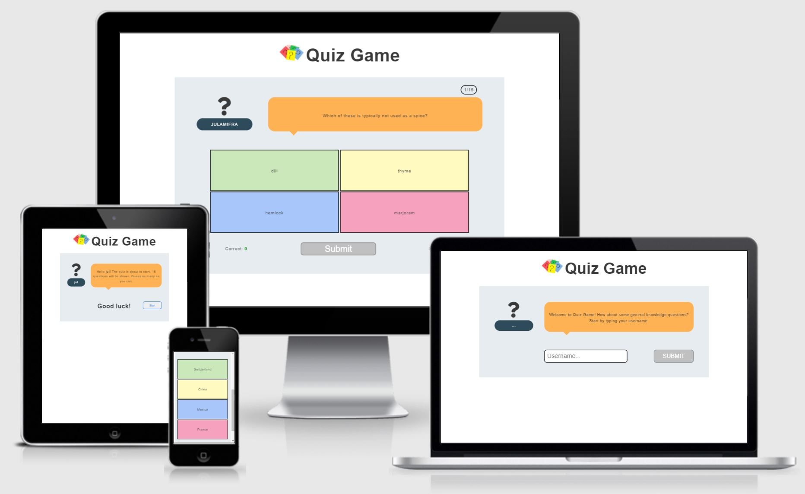

# QUIZ-GAME

Quiz-game is developed to test user's general knowledge, by asking 15 random questions. Desiginig a very user-friendly and colourful interface, users will be able to set their user name and later on  proceed directly to answer the questions.

After 15 questions a pop-up will show up, where the final score will be displayed. Users will be able to start a new game by clicking on the button below this score.

# Table of Contents

- [User Stories](#user-stories)
- [Features](#features)
- [Future features](#future-features)
- [Typography and color scheme](#typography-and-color-scheme)
- [Wireframes](#wireframes)
- [Technologies](#technologies)
- [Testing](#testing)
- [Deployment](#deployment)
- [Credits](#credits)

## User Stories
1) As an user I want to see the welcome message, the logo and the username input as the first page of the website.
2) 

## Features

- __Header__

    - Featured ...

- __Answer__

- __Score__

## Future features

- One posible future feature might be ...
## Typography and color scheme

- __Typography__

- __Color Scheme__

## Wireframes

## Technologies

- HTML and CSS: 
    - **HTML** is the standard markup language for Web pages.
    - **CSS** is the language we use to style and HTML document.
    - Both programing languages are the main technologies used in this project in order to create the webpage. 
- JavaScript: ...
- GitHub Pages: it is a static site hosting service. It take the code from a Github reposiroty and publishes a website. It will be explained in further detail in the [Deployment](#Deployment) section.
- GitPod: this tool has been chosen as the IDE of this project. It is a cloud development environment accessible via a browser, that can be run directly from the github repository.

## Testing

### Test cases and fixed bugs

    
### Code validation

- __HTML:__ 

- __CSS:__

- __JS:__ 
<!-- https://jshint.com/ -->

### Lighthouse - Dev Tools

### Supported screens and browsers

## Deployment

## Credits

### Content and Media

<!-- https://google.github.io/styleguide/jsguide.html#jsdoc-general-form -->

