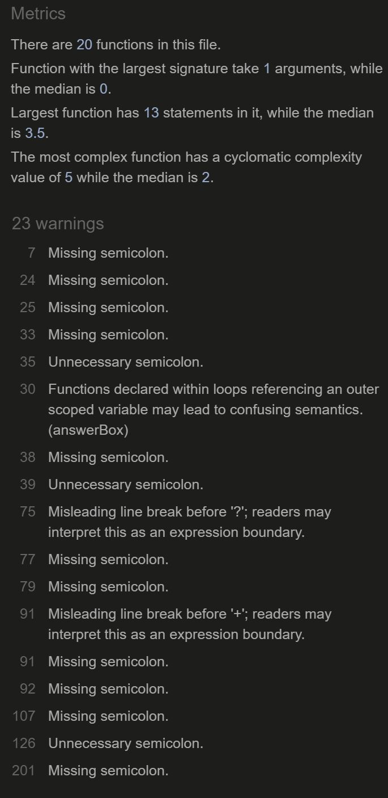

# QUIZ-GAME

Quiz-game is developed to test user's general knowledge, by asking 15 random questions. Desiginig a very user-friendly and colourful interface, users will be able to set their user name and later on proceed directly to answer the questions.

After 15 questions a pop-up will show up, where the final score will be displayed. Users will be able to start a new game by clicking on the button below this score.

# Table of Contents

- [User Stories](#user-stories)
- [Features](#features)
- [Future features](#future-features)
- [Typography and colour scheme](#typography-and-colour-scheme)
- [Wireframes](#wireframes)
- [Technologies](#technologies)
- [Testing](#testing)
- [Deployment](#deployment)
- [Credits](#credits)

## User Stories

1. As an user I want to see the welcome message, the logo and the username input as the first page of the website.
2. As an user I want to be able to set my username, where the input validate the non-alphanumeric characters.
3. As an user I want to see the second view where the first question and the 4 answers are displayed.
4. As an user I want to see a pop-up when the quiz is completed, in which I can see the score and a button to restart the game.

## Features

- **Header**

  

  - Feature at the very top of the website.
  - In the header only appear the logo and name of the website game.

- **Username section**

  

  - In here, firstly, users will see a welcome message, encouraging them to play and setting their username.
  - In order to start the quiz, users must enter their username, which will be displayed in the left top of the page while the user is playing.
  - This username parameter is required, in order to start the game. The submit button will remain disable, until the user types any alphanumeric character (maximum 10 characteres).
  - By clicking on the submit button, if any strange character has been set, an error message will be shown.
    
  - After choosing and appropiate name and submiting it, a new encoured message will be displayed. Users must click on the Start button in order to be redirected to the game section page.
    

- **Game section**

  

  - This is the main page where 15 different questions (with 4 possible answeres) will be appearing, until the game is done.
  - Within the orange box, the questions will be shown. Below the question, four possibles answered will be displayed with a different colour each.
  - Once one answer has been selected, by clicking on the submit button, users will known the correct answer.
  - If the correct answer is selected, the view will look like this:
    
    By clicking on the next button, the new question will be displayed.
  - If an incorrect answer is submited, the new view will show which answer was the correct one.
    
  - In addition, on the right top users will be able to see a round counter, that will be displaying the number of the current question that is answering:
    

- **Score section**

  

  - Once the quiz is completed, a pop-up will appear in the middle of the page, in which the user will be able to see the final score.
  - A 'Try again' button is displayed below this score message. By clicking on it, the game will be restarted, and new 15 questions will be asked to the user.

## Future features

- One posible future feature might be to create a score, where users can see all their scores.
- Another possible feature would be to divide the type of questions that are shown, by giving a topic select.

## Typography and colour scheme

- **Typography**

  - The typography for this game project is not as important as other websites where are more focused on what the user is reading, as their contains a lot of paragraphs to read.

- **colour Scheme**
  - In this case, I've decided to use a very colourful style, like on the [Kahoot](https://www.kahoot.com/) website.
  - Each of the answers has a different colourful colour, as well as the question box.

## Wireframes

- [Moqups](https://app.moqups.com/) is the app used to prepare the first idea of the project.
- Below some snippets of them are shown:

## Technologies

- **HTML** is the standard markup language for Web pages.
- **CSS** is the language we use to style and HTML document.
- **JavaScript**: JavaScript is a scripting or programming language that allows you to implement complex features on web pages, creating dynamically updating content, control multimedia, animate images, and so on.
- **GitHub Pages**: it is a static site hosting service. It take the code from a Github reposiroty and publishes a website. It will be explained in further detail in the [Deployment](#Deployment) section.
- **GitPod**: this tool has been chosen as the IDE of this project. It is a cloud development environment accessible via a browser, that can be run directly from the github repository.

## Testing

### Test cases and fixed bugs

- In order to pass all the User Stories tests, these are the steps that have been followed to test them:

  - User Story number 1:

    - The logo and the name of the game must be centered on the top of the website.

  - User Story number 2:

    - The username input must remain on the left side, while the submit button on the right, just beside the input.
    - This username parameter will be a required parameter.
    - 10 is the maxixum number of characteres that an user can set on the username input.
    - The non-alphanumeric validation will be done after clicking on the submit button.
    - This button is disabled, unless the user type any character.
    - If the validation is successful, no error will be shown and the user will be redirected to the next view. On the contrary, an error message will be displayed underneath the input.

  - User Story number 3:

    - The set username must be displayed on the left top, under the question mark icon.
    - The first question must be displayed on the orange box, at the top of this game section.
    - The round counter (1/15) must be on the right top of the screen.
    - Just below the question, the four posible answers of this question will appear. Each with a different background colour.
    - At the bottom of the website, the submit button will be in the centre, and the correct and incorrect score will be on either side of it.
    - By clicking on one of the answers, it will set a red border colour.
    - Then, the submit button will be enable. By clicking on it, the user will submit the chosen answer.
    - If the answer is correct, one is added to the correct answer score.
    - If the answer is incorrect, one is added to the incorrect answer score.
    - Then, the user will see a next button in stead of the submit button. By clicking on it, the next question will be displayed and the round counter will add up to 1.

  - User Story number 4:
    - Once the quiz is completed, after 15 questions, a blue pop-up will be displayed on the website.
    - Within it, a 'congratulations' message and a 'Try again' button will be displayed.
    - By clicking on the 'Try again' button, the user will restart the quiz by having 15 different questions.

### Code validation

- **HTML:**
  

  These Error have been fixed by adding the correct end tag in the div element, in line 33 from the game.html file.

- **CSS:**
  
  

  The CSS validaton has been done with [CSS validator](https://www.cssportal.com/css-validator/). In this case, some warnings have been suggested by the validator. No errors have been found.

- **JS:**
  
  

  In order to validate the JavaScript code, the tool used is [JSHint](https://jshint.com/). In here, only some warnings have been found; most of them due to missing semicolon or unnecessary semicolon.

  All this warnings have been fixed.

### Lighthouse - Dev Tools

- Lighthouse DevTool performance for desktop in the index.html
  

- Lighthouse DevTool performance for desktop in the game.html
  

- Lighthouse DevTool performance for mobile in the index.html
  

- Lighthouse DevTool performance for mobile in the game.html
  

### Supported screens and browsers

- The website was tested on the most common screen sizes. The sizes where possible erros could appeared were: 850px, 650px. For this reason, two different styles have been set for these cases.

- The browsers where the website has been tested are Firefox and Google Chrome. In the case of the former, the tests have only carried out for desktop size. For the latter, tests for mobile and desktop sizes have been done.

## Deployment

The website was deployed to GitHub pages. These are the steps to deploy it:

Navigating to the GitHub repository settings tab, you will find the "Pages" tab.
In this tab, choosing the main branch of the site and saving the changes it is enough to deploy.
Once it has deployed (it could take 5-10 minutes) the site would be available on the URL shown in this "pages" tab.
The deployed URL for this project is the following: [Deployed URL](https://julamifra.github.io/quiz-game/index.html).

## Credits

I like to thank my tutor, Rohit, for all the recommendations he has given me.

### Content and Media

- In order to see how to use JSDoc: [JSDoc documentation](https://google.github.io/styleguide/jsguide.html#jsdoc-general-form)
